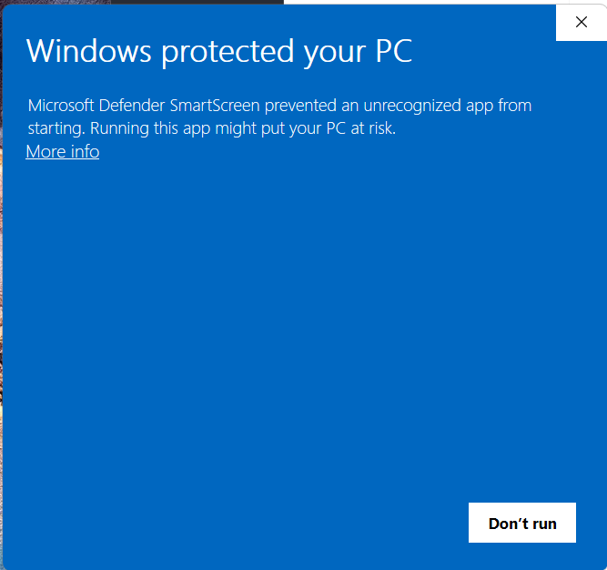
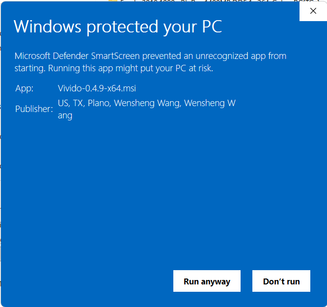

# Using Vivido on Windows

Vivido supports Windows 11 x64, build 22000 or newer, and renders with DirectX 12. This guide
covers what Windows users need to know after installation.

## SmartScreen warning when installing

Vivido's installers are signed, but a new release has not yet built up reputation with Microsoft
Defender SmartScreen. When you run `VividoSetup-X.Y.Z-x64.exe` or `Vivido-X.Y.Z-x64.msi`, Windows
may show a **Windows protected your PC** dialog that offers only **Don't run**:



To continue:

1. Click **More info**. The dialog now shows the file name and its publisher.
2. Check that **App** is the installer you downloaded and that **Publisher** is
   `Wensheng Wang`. If the publisher is missing or different, click **Don't run** and download the
   installer again from the official Vivido release page.
3. Click **Run anyway**.



The prompt appears once per downloaded installer and goes away as each release gains reputation.

## Two Vivido entries: PowerShell and WSL

The installer creates two Start Menu shortcuts. Both start the same `vivido.exe`; they differ only
in the shell they launch:

| Shortcut | Command | Shell |
|---|---|---|
| **Vivido PowerShell** | `vivido.exe -e pwsh.exe` | PowerShell 7 |
| **Vivido WSL** | `vivido.exe -e wsl.exe` | The default WSL distribution (Ubuntu after a consumer install) |

Plain `vivido.exe` with no `-e` uses `[terminal] shell` from the configuration file, which the
installer sets to `pwsh.exe`. Inside any window, the tab `˅` menu offers `PowerShell` and one
`WSL: <distribution>` row per installed distribution, so both kinds of shell can live in one window.
Vivido probes for those shells once per session: a distribution installed while Vivido is running
appears the next time Vivido starts.

No desktop shortcut or taskbar pin is created. Pin a Start Menu shortcut yourself if you want one.

## WSL: `TERM=vivido` and the terminfo entry

Vivido sets `TERM=vivido` and `COLORTERM=truecolor` for its shells and forwards both into WSL
through `WSLENV` (the installer also adds `TERM/u:COLORTERM/u` to your user `WSLENV`), so a WSL
shell started from Vivido sees `TERM=vivido`.

On the Windows side this needs no setup: Vivido carries its own compiled terminfo entry and points
its children at a private copy. **That private copy does not reach WSL.** WSL receives the `TERM`
value, but not the Windows-side `TERMINFO` directory, and a stock Ubuntu does not ship a `vivido`
entry. Until you install it, curses programs in Vivido WSL (`nano`, `vim`, `less`, `htop`, `tmux`,
`man`, `apt`'s progress bar) may print errors such as:

```text
'vivido': unknown terminal type.
WARNING: terminal is not fully functional
```

### Install the entry once per WSL distribution

Do this from **Windows Terminal's WSL profile** (or any terminal other than Vivido). Windows Terminal
runs WSL with `TERM=xterm-256color`, which every distribution understands, so the editors and
package tools you use during setup behave normally.

1. Open Windows Terminal and start a tab for your distribution (for example, *Ubuntu*).
2. Make sure `tic` is available. Ubuntu and Debian ship it in `ncurses-bin`, which is normally
   already installed:

   ```sh
   sudo apt update && sudo apt install ncurses-bin curl
   ```

3. Get `vivido.info` and compile it system-wide:

   ```sh
   curl -fsSLO https://raw.githubusercontent.com/vivido-dev/vivido/master/extra/vivido.info
   sudo tic -x -e vivido,vivido-direct -o /usr/share/terminfo vivido.info
   rm vivido.info
   ```

4. Verify both as your user and through `sudo`:

   ```sh
   infocmp vivido >/dev/null && sudo infocmp vivido >/dev/null && echo ok
   ```

5. Close every Vivido WSL window and open a new one. `echo $TERM` should print `vivido`, and
   curses programs should work without warnings.

Repeat these steps in **each** WSL distribution you use; every distribution has its own terminfo
database. Installing into `/usr/share/terminfo` (rather than `~/.terminfo`) keeps the entry visible
through `sudo`, which discards a per-user `TERMINFO` path.

If you are already in a Vivido WSL window and cannot switch terminals, run the steps from a shell
started with a widely known terminal type, then open a new window:

```sh
TERM=xterm-256color bash
```

For a single command, `TERM=xterm-256color <command>` is also a safe temporary workaround.

### Vivido tools inside WSL

The command-line tools the installer puts in `%LOCALAPPDATA%\Programs\Vivido` — `vvssh`, `vivi`,
`vvrd`, `vvmux`, and the rest — are Windows executables. They work in Vivido PowerShell tabs but
**are not available in WSL**: WSL does not put that directory on its Linux `PATH`, and Linux
programs such as `vivi` must be Linux builds to talk to Vivido from a WSL shell.

To use them in WSL, install Linux builds with Cargo inside each distribution you use:

```sh
cargo install --locked vivi vvrd vvmux
cargo install --locked vivido   # provides vvssh
```

This needs a Rust toolchain and the Linux build dependencies in that distribution; see
[`linux.md`](linux.md) for the packages and for installing from a source checkout. Cargo puts the
executables in `~/.cargo/bin`, which must be on your WSL `PATH`.

### SSH from WSL to other machines

A remote host needs the entry too, otherwise remote curses tools see an unknown `TERM=vivido`. Once
the entry is installed in WSL, copy it to a remote host with:

```sh
infocmp -x vivido | ssh remote-host tic -x -
```

Use `vvssh` instead of plain `ssh` when you want remote `vivi` media to show in your Vivido window.
`vvssh` also falls back to `xterm-256color` for remote shells whose host lacks the `vivido` entry.
Inside WSL you need a Linux build of `vvssh`; see
[Vivido tools inside WSL](#vivido-tools-inside-wsl).

## Media from WSL

Vivido exports its per-window Vivid discovery values into WSL through `WSLENV`, so a Linux build of
`vivi` (or another Vivid producer) running in WSL can display images, video, and audio in the native
Windows Vivido window. Install that Linux build as described in
[Vivido tools inside WSL](#vivido-tools-inside-wsl). Keep in mind:

- The values are exported one way (`/u`): Windows to WSL only. Do not add `VIVID_ROOT_SECRET` to
  `WSLENV` yourself without `/u`, or add it to a shell profile; it would then leak to every Windows
  process launched from Linux. Never print, log, or copy that secret.
- Do not remove `TERM/u:COLORTERM/u` from your user `WSLENV`. Vivido preserves any other entries
  you add, and it rewrites its own entries for each window, so stale endpoint entries are cleaned
  up automatically.
- ConPTY strips APC control strings, so on Windows producers use a printable anchor marker that
  Vivido authenticates and removes (`VIVID_ANCHOR_TRANSPORT=conpty`). Current `vivi` builds handle
  this; older or third-party producers that emit APC anchors will not place media correctly.
- Only programs started from a Vivido window inherit these values. A WSL shell started from Windows
  Terminal, or a `wsl.exe` launched outside Vivido, has no Vivid endpoint.

## Installation notes

- **Two installers.** `VividoSetup-X.Y.Z-x64.exe` is the consumer installer: it installs
  PowerShell 7 LTS when missing, provisions WSL with Ubuntu, and installs Vivido. The standalone
  `Vivido-X.Y.Z-x64.msi` assumes PowerShell 7 and WSL are already present; use it on managed
  machines.
- **Per-user install.** `vivido`, `vivi`, `vvmux`, and `vvssh` go to
  `%LOCALAPPDATA%\Programs\Vivido`, which is added to your user `PATH`. Open a new terminal after
  installing so the updated `PATH` and `WSLENV` take effect.
- **SmartScreen.** See [SmartScreen warning when installing](#smartscreen-warning-when-installing).
- **Uninstall and upgrade with vvmux.** Setup refuses to continue while a `vvmux` session is live.
  List sessions with `vvmux list` and end them with `vvmux kill-session -t NAME`; setup never
  kills a session for you.

## Configuration

Vivido reads the first file that exists:

1. `%USERPROFILE%\.config\vivido\vivido.toml`
2. `%USERPROFILE%\vivido\vivido.toml` — written by the installer when no config exists

The config file is yours: repair, upgrade, and uninstall never overwrite or delete it. See
[`configuration.md`](configuration.md) for every option. Windows-specific behavior to know about:

- The default font is `Consolas`. Set `[font] normal.family` to use a different installed font.
- Right-click pastes the clipboard when the running application is not capturing the mouse.
- To make WSL the default for plain `vivido.exe`, set:

  ```toml
  [terminal]
  shell = "wsl.exe"
  ```

  Pass arguments with the `{ program, args }` form, for example
  `shell = { program = "wsl.exe", args = ["-d", "Debian"] }` for a specific distribution.
- Vivido exports `SHELL` with the program it actually launched, so nested tools such as `vvmux`
  reopen the same shell instead of falling back to `cmd.exe`.
- For interactive PowerShell, Vivido adds a prompt hook at launch that reports the current
  directory to Vivido. It does not modify your PowerShell profile.
- The automation endpoint (`vivido msg …`) is an owner-only named pipe on Windows rather than a
  Unix socket.
- The rendering backend is always DirectX 12 and cannot be changed. Keep your GPU driver current.
